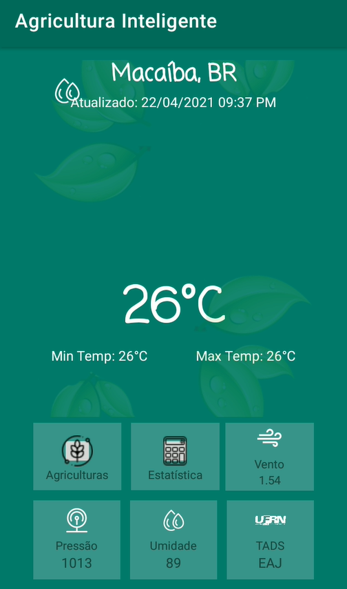
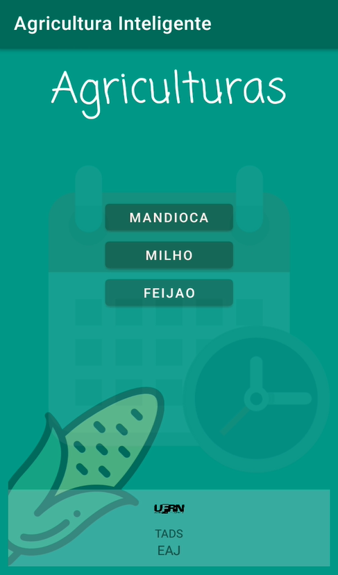
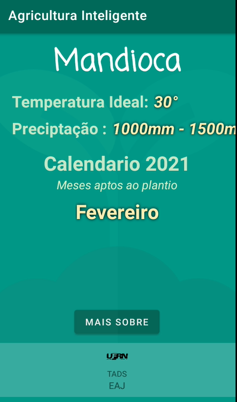
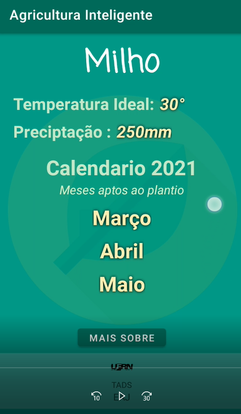
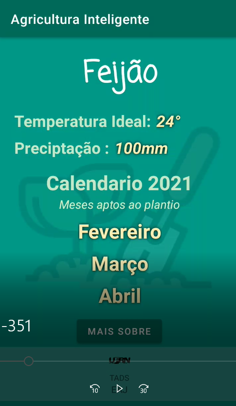

# Agricultura Inteligente
*Project for mobile :iphone: - Agroclimatology for rural producers - 2021 ©UFRN

## Home

## Screens

    

## Statistic

## Contributors
- [Lucas Gabriel](https://github.com/v0ltmx)
- [Lucas Araújo](https://github.com/Araujo96)
- [Eric Costa](https://github.com/ericosta-dev)
- [Emanuel](https://github.com/manelB1)
- [Dimitrio Krislley](https://github.com/O-tal-do-Dimik)

 

